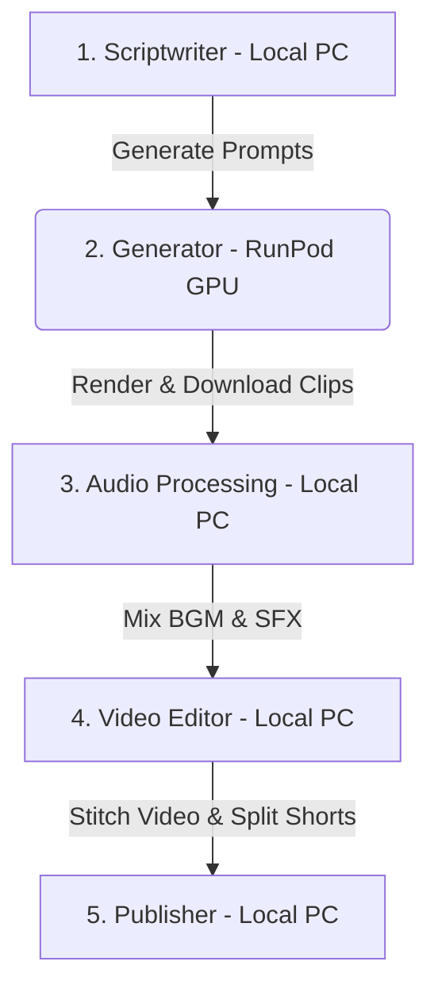

# Action Clip Bot — Complete User Manual

Welcome to the **Action Clip Bot** user manual. This document serves as the complete operational guide for running, configuring, and maintaining your automated AI video generation pipeline.

---

## 1. System Architecture & Lifecycle

The bot uses a split-compute architecture to keep running costs extremely low:



*   **Local PC (CPU & RAM):** Handles script writing (Gemini), audio selection (Jamendo / Freesound), video editing (FFmpeg), and social media publishing.
*   **RunPod Pod (GPU VRAM):** Starts on-demand at Phase 2 to run the heavy Wan 2.2 diffusion model, renders the raw video clips, and is shut down immediately after downloads finish to minimize billing.

---

## 2. Configuration & Credentials (`.env`)

All secret keys and environment parameters live in the `.env` file in the root directory:

```ini
# =============================================================================
# RunPod GPU Automation
# =============================================================================
RUNPOD_API_KEY=your_runpod_api_key
RUNPOD_POD_ID=your_active_pod_id
RUNPOD_NETWORK_VOLUME_ID=your_volume_id

# HuggingFace Auth Token (Required for gated models)
HF_TOKEN=your_huggingface_token

# Active model on the GPU server
WAN_MODEL_ID=Wan-AI/Wan2.2-T2V-A14B-Diffusers

# =============================================================================
# Local API Integrations
# =============================================================================
GEMINI_API_KEY=your_gemini_key
JAMENDO_CLIENT_ID=your_jamendo_music_key
FREESOUND_API_KEY=your_freesound_sfx_key
```

---

## 3. RunPod Pod Management & Migration Guide

### Network Volume vs. Container Disk
*   **`/workspace/` (Network Volume):** Persists forever. Contains your `gpu_server.py`, logs, and the **Hugging Face model cache** (~25GB).
*   **`/root/venv/` (Container Disk):** Ephemeral. Cleared whenever the pod is deleted, rebuilt, or migrated. On first boot of a new pod, `gpu_server.py` automatically reinstalls Python packages in under 3 minutes.

### Manual Pod Startup Runbook
If the automatic SSH bootstrap gets stuck (due to RunPod API/host lag), follow these steps to prepare your pod manually:

1.  **Start/Migrate Pod:** Provision a pod with a 24GB+ VRAM GPU (A10G, RTX 3090, RTX 4090, L4) and attach your persistent volume `j7a4lou0dd`. Make sure TCP port `8000` is exposed.
2.  **SSH into the Pod:**
    ```bash
    ssh -p <PORT> root@<IP>
    ```
3.  **Launch the GPU Server:** Paste the following into the SSH terminal:
    ```bash
    export HF_TOKEN=<your_huggingface_token>
    export HUGGING_FACE_HUB_TOKEN=<your_huggingface_token>
    export WAN_MODEL_ID=Wan-AI/Wan2.2-T2V-A14B-Diffusers
    export PYTHONUNBUFFERED=1
    nohup python3 -u /workspace/gpu_server.py > /workspace/gpu_server.log 2>&1 &
    echo "Started PID: $!"
    ```
4.  **Monitor Progress:** Run `tail -f /workspace/gpu_server.log` and wait for:
    `Model loaded successfully! Ready to generate videos.`
5.  **Update Local Config:** Write the new Pod ID into your local `.env` as `RUNPOD_POD_ID`.
6.  **Restart Dashboard:**
    ```bash
    kill $(lsof -ti:8080) 2>/dev/null || true
    nohup scripts/run_dashboard.sh >> data/dashboard.log 2>&1 &
    ```

---

## 4. How to Generate Videos

### Method A: Web Dashboard (Recommended)
1.  Start the local dashboard:
    ```bash
    scripts/run_dashboard.sh
    ```
2.  Open your browser and navigate to `http://localhost:8080`.
3.  Use the controls to start a run, monitor active progress, manage API keys, and track costs.

### Method B: Command Line Interface (CLI)
*   **Run a Quick Test (3 clips, 5s each, dry-run publish):**
    ```bash
    .venv/bin/python3 -m src.pipeline --quick-run
    ```
*   **Run a Full Production Video (12-13 clips, 6s each):**
    ```bash
    .venv/bin/python3 -m src.pipeline
    ```

---

## 5. Logs & Troubleshooting

### Local Logs (Local PC)
*   **File:** `data/dashboard.log` or the console output.
*   **What they show:** Scriptwriter prompts, SSH connection attempts, Jamendo downloads, FFmpeg execution, and publishing API requests.
*   **Command to watch live:** `tail -f data/dashboard.log`

### Remote Logs (GPU Pod)
*   **File:** `/workspace/gpu_server.log` (on the pod).
*   **What they show:** Pip installations, Hugging Face downloads, PyTorch model status, VRAM usage, and generation step progress.
*   **Command to watch live (SSH):** `tail -f /workspace/gpu_server.log`

### Troubleshooting Common Errors

| Error | Root Cause | Solution |
|---|---|---|
| **503 Service Unavailable** | Model is still loading into memory. | Wait 1-2 minutes and poll again. |
| **CUDA Out of Memory** | Model loaded without CPU offloading or too large. | Ensure `WAN_MODEL_ID` is set to `Wan-AI/Wan2.2-T2V-A14B-Diffusers` and single-expert mode is active. |
| **Connection Refused (SSH)** | Container SSH daemon is booting. | Wait 30 seconds for the pod to fully start up. |
| **Disk Space 100% Full** | Multiple duplicate HF caches are stored. | Clean up old folders in `/workspace` leaving only `/workspace/huggingface/`. |

---

## 6. Output Files Location

Once a run finishes successfully, all generated media is stored in `data/runs/<timestamp>/`:
*   `clips/`: Raw video clip files downloaded from the GPU server.
*   `audio/`: Downloaded music tracks (from Jamendo) and sound effects (from Freesound).
*   `final/`: Stitched outputs:
    *   `horizontal.mp4` (16:9 widescreen)
    *   `vertical.mp4` (9:16 vertical widescreen)
    *   `vertical_part1.mp4` / `vertical_part2.mp4` (split versions if length exceeds 60s)
