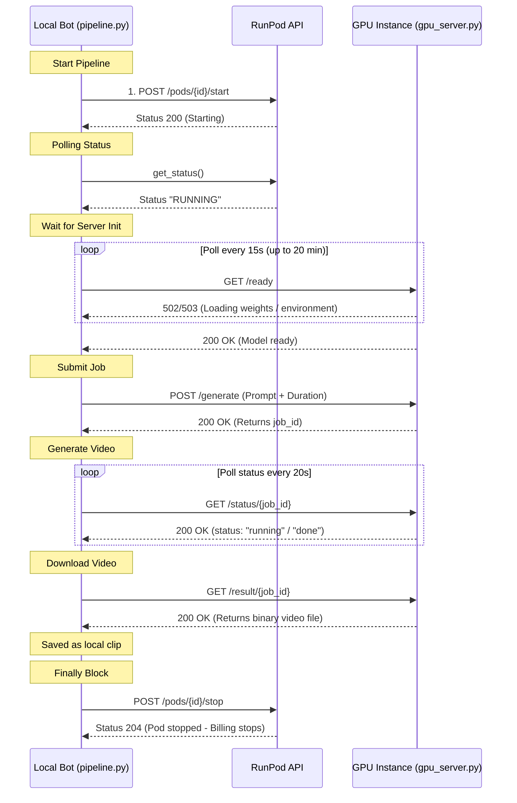

# Action Clip Bot — RunPod GPU Integration & Lifecycle Architecture

This document serves as the complete technical manual for how the **Action Clip Bot** interacts with the **RunPod GPU VPS** backend. It outlines the network topology, step-by-step code lifecycles, configuration mappings, and automatic failover/provisioning mechanisms.

---

## 1. System Architecture & Port Mapping

```
+------------------+                   +-----------------------------------------------+
|                  |                   | RunPod GPU VPS (Docker Container)             |
|                  |                   |                                               |
|  Local Bot       |                   |  +-----------------------------------------+  |
|  (Orchestration) |                   |  | JupyterLab Server (Port 8888)            |  |
|                  |                   |  | Used for file uploads / monitoring      |  |
|  1. Auto-Start   |                   |  +-----------------------------------------+  |
|  2. Poll /ready  |  HTTP (Port 8000) |                                               |
|  3. POST /generate +---------------->|  +-----------------------------------------+  |
|  4. Poll status  |  Proxy/Tunnel URL |  | FastAPI Server (gpu_server.py: Port 8000) |  |
|  5. GET result   |                   |  | Runs Wan 2.2 model inference inside venv|  |
|  6. Auto-Stop    |                   |  +-----------------------------------------+  |
|                  |                   |                       |                       |
|                  |                   |                       v                       |
|                  |                   |  +-----------------------------------------+  |
|                  |                   |  | Persistent Network Volume (/workspace)  |  |
|                  |                   |  | Stores venv/ & HuggingFace weights      |  |
|                  |                   |  +-----------------------------------------+  |
+------------------+                   +-----------------------------------------------+
```

### Exposed Container Ports:
*   **Port 8888 (JupyterLab):** RunPod's built-in web IDE. Used once to drag-and-drop the `gpu_server.py` file into the container.
*   **Port 8000 (FastAPI Server):** Serves the model inference API. It supports asynchronous task queueing to prevent HTTP connection drops during heavy generation workloads.

---

## 2. Step-by-Step Code Lifecycle

When you trigger a video generation run (e.g. via `scripts/run_job.sh` or the dashboard), the pipeline executes the following sequence:



---

## 3. High-Performance Cold-Start Optimization

Rather than using a custom Docker image which requires local Docker installations and manual builds, the bot uses the **official RunPod PyTorch base image** combined with a **Persistent Virtual Environment**.

### The First Boot:
1. RunPod starts a clean PyTorch container and mounts your Network Volume at `/workspace`.
2. The start command runs: `python /workspace/gpu_server.py`.
3. `gpu_server.py` detects that `/workspace/venv` does not exist.
4. It initializes `/workspace/venv` and runs a local `pip install` to load pinned versions of `diffusers`, `transformers`, `accelerate`, and the `nvidia-modelopt` FP8 quantizer.
5. Once completed, it re-executes itself inside the venv: `os.execv("/workspace/venv/bin/python", ...)` and starts the FastAPI server.
6. *Time elapsed:* **~5 minutes** (happens only once).

### Subsequent Boots:
1. RunPod starts the PyTorch container.
2. The start command runs `python /workspace/gpu_server.py`.
3. `gpu_server.py` detects `/workspace/venv` exists.
4. It immediately re-executes itself using the virtual environment python.
5. The FastAPI server starts running.
6. *Time elapsed:* **< 10 seconds** (instant start).

---

## 4. Automatic Failover & Pod Provisioning

Cloud GPUs are often rented on a spot-preemptible basis. If your GPU gets preempted or the datacenter runs out of H200 or RTX 4090 GPUs, the pipeline will **automatically recover without failing**:

1. **Start Fails:** When the bot calls `start_pod()`, the RunPod API returns a `GPU no longer available` error.
2. **Trigger Auto-Provisioning:** The bot detects the error and executes `_provision_new_pod()`.
3. **Provision Replacement Pod:** The bot makes a POST request to RunPod to deploy a new pod:
    * It uses the same image configured in `RUNPOD_IMAGE`.
    * It mounts your existing **Network Volume ID** (`RUNPOD_NETWORK_VOLUME_ID`).
4. **Volume Recovery:** The new pod boots up. Since it mounts your persistent network volume:
    * All previously downloaded Hugging Face model weights (`/workspace/huggingface`) are already there.
    * The virtual environment (`/workspace/venv`) is already there.
5. **Sync Configuration:** The bot rewrites `RUNPOD_POD_ID` in your local `.env` with the new Pod ID so future pipeline steps direct requests to the new host.
6. **Execution Continues:** The bot polls the new proxy URL and proceeds with generation.

---

## 5. Deployment & Configuration Guide

### A. One-Time RunPod Setup
1. **Network Volume:** Create a volume named `action-clip-bot-vol` in the **RunPod console under Storage**. Allocate **50 GB** minimum. Copy its ID.
2. **GPU Pod:** Deploy a pod (recommended: **NVIDIA H200** or **NVIDIA GeForce RTX 4090**).
    * **Image:** `runpod/pytorch:2.8.0-py3.11-cuda12.8.1-devel-ubuntu22.04`
    * **Container Disk:** `30 GB`
    * **Expose Ports:** Add `8000/http`, `8888/http`, `22/tcp`.
    * **Container Start Command:** 
      ```bash
      bash -c 'while [ ! -f /workspace/gpu_server.py ]; do sleep 5; done; python /workspace/gpu_server.py'
      ```
    * **Environment Variables:**
      * `WAN_MODEL_ID` = `Wan-AI/Wan2.2-T2V-A14B-Diffusers`
      * `HF_HOME` = `/workspace/huggingface`
      * `DEPS_PREINSTALLED` = `0`
3. **JupyterLab Upload:** Once the pod status is RUNNING, click **Connect** → **Connect to JupyterLab**, and upload `gpu_server.py` from this project directory.
4. **Stop the Pod:** Stop the pod manually in the dashboard (you only need to pay when the bot runs).

### B. Local Configuration
Add the details to your project `.env` file:
```ini
RUNPOD_API_KEY=your_runpod_api_key
RUNPOD_POD_ID=your_created_pod_id
RUNPOD_NETWORK_VOLUME_ID=your_network_volume_id
RUNPOD_GPU_TYPE="NVIDIA H200"
RUNPOD_IMAGE=runpod/pytorch:2.8.0-py3.11-cuda12.8.1-devel-ubuntu22.04
```

### C. Run the Pipeline
Run the script to test the connection end-to-end:
```bash
scripts/run_job.sh --quick-run
```
All details of the run (including pod status transitions, proxy discovery, model loading, and clip stitching) will be logged to `data/quick_run.log`.
